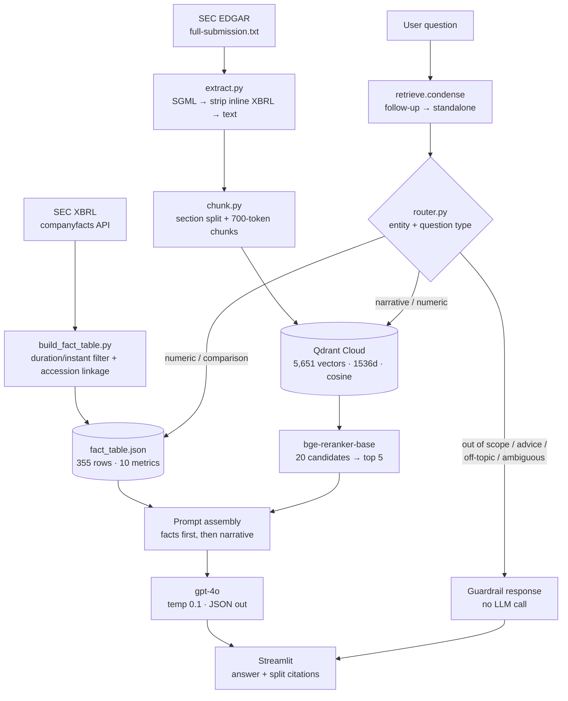

# SEC 10-K Research Assistant

Retrieval-augmented Q&A over the **40 most recent 10-K filings** of eight US companies —
Alphabet, McDonald's, Apple, Coca-Cola, Microsoft, Nike, Nvidia and Disney — five fiscal
years each.

The design question this project is actually about: **RAG systems are bad at numbers.**
Asking an LLM to read "$383,285" out of a wall of prose and repeat it exactly is a
hallucination surface with no upside. So numbers don't go through the language model at
all. They're pulled from SEC's own XBRL data into a structured fact table and injected
into the prompt as authoritative, while the vector store handles what it's good at —
explanations, risk factors, strategy, trends.

---

## Architecture



**Two retrieval paths, one prompt.** `[F1]`-style citations are exact XBRL values; `[3]`-style
citations are model-summarised prose. The UI renders them differently on purpose — a reader
should be able to see at a glance which numbers are verified and which text is a summary.

---

## What the pipeline actually produced

| Stage | Result |
|---|---|
| Filings downloaded | **40 / 40** (8 companies × 5 fiscal years) |
| Clean text extracted | **40 / 40**, 0 failures, 0 U+FFFD replacement characters |
| Corpus size | 14.8 M characters |
| Chunks | **5,651** (mean 669 tokens, 3.78 M tokens total) |
| Core sections found | Items 1, 1A, 2, 5, 7, 8, 9A present in **40 / 40** filings |
| Fact table | **355 rows**, 10 metrics × 8 companies × 5 years |
| Revenue cross-check | **40 / 40** XBRL values found verbatim in their own filing's text |
| Vector store | **5,651 / 5,651** points in Qdrant Cloud, all 40 company-years present |
| Routing + fact eval (offline) | **20 / 20** cases, 65 / 65 checks |
| Accuracy eval (end-to-end) | **22 / 22** cases, 43 / 43 checks |
| Guardrail eval (end-to-end) | **14 / 14** cases, 44 / 44 checks |

> **Status.** Fully built and run end to end. All 40 filings downloaded, extracted,
> sectioned and chunked; the fact table validated against the filings themselves; 5,651
> chunks embedded and upserted into Qdrant Cloud (1536d, cosine, payload-indexed); and
> both eval suites passing against live `gpt-4o` and live retrieval — including the
> two multi-turn condensation cases and the prompt-injection-inside-retrieved-context
> guardrail.

Fiscal-year coverage differs by company because fiscal calendars do:

| Company | Fiscal year end | Years in scope |
|---|---|---|
| Alphabet (GOOGL) | December 31 | FY2021 – FY2025 |
| McDonald's (MCD) | December 31 | FY2021 – FY2025 |
| Apple (AAPL) | last Saturday of September | FY2021 – FY2025 |
| Coca-Cola (KO) | December 31 | FY2021 – FY2025 |
| Microsoft (MSFT) | June 30 | FY2022 – FY2026 |
| Nike (NKE) | May 31 | FY2022 – FY2026 |
| Nvidia (NVDA) | last Sunday of January | FY2022 – FY2026 |
| Disney (DIS) | Sunday closest to Sept 30 | FY2021 – FY2025 |

Every chunk and every fact row carries `fiscal_year_end_date`, not just an `FY2025` label —
so "Apple's FY2025" (ended 2025-09-27) is never silently compared against "Microsoft's
FY2025" (ended 2025-06-30) as if they covered the same period.

---

## The numeric-precision design decision

This is the part worth reading.

A 10-K states revenue in prose, in tables, in the financial statements and again in the
notes — often in different units (millions vs. thousands) and always surrounded by other
numbers. Retrieving a chunk and asking the model to extract "the" revenue figure is a coin
flip on formatting at best, and a fabrication at worst.

Instead, `build_fact_table.py` reads SEC's XBRL `companyfacts` API, which returns every
tagged fact a company has ever filed as clean JSON. Three details make it correct rather
than merely plausible:

1. **Duration vs. instant facts.** Revenue and net income are *duration* facts carrying
   `start` and `end`; total assets and equity are *instant* facts with only `end`. A 10-K
   also contains quarterly durations. Duration facts are filtered to a 340–400 day window,
   or a Q4 number silently lands in the annual row.

2. **Accession-number linkage.** The same fact appears in three consecutive 10-Ks as
   comparative data. Matching on the accession number from the download manifest pins each
   value to the filing that originally reported it — and gives the citation the same
   identifier the narrative chunks carry, so `[F1]` and `[3]` can be traced to the same
   document.

3. **Per-year tag resolution.** `Revenues` vs.
   `RevenueFromContractWithCustomerExcludingAssessedTax` varies by company *and by year*.
   Alphabet renamed its tag mid-window, so no single tag covers all five years — resolving
   one tag per company drops FY2022 without an error. Tags are resolved per fiscal year,
   and where two tags both report a year, a disagreement is reported rather than silently
   resolved.

Verified end to end: all 40 revenue figures pulled from XBRL appear **verbatim** in the
text of their own filing. That check is the one that catches a well-populated but
semantically wrong tag; a spot check on two values cannot.

Testing against a live model showed this needs enforcing in two places, not one. Asked for
Nike's operating income — a metric Nike does not tag — `gpt-4o` reached into the narrative
context, derived EBIT and presented it as operating income. The system prompt now forbids
substituting or deriving a measure, *and* the router passes the specific missing
`(company, year, metric)` into the prompt so the instruction is concrete rather than
general. The same pattern applies to fiscal-period misalignment and to quoting the fiscal
year end date: the condition is detected in code and stated in the prompt, because the
model reliably forgets both when the answer looks simple.

**Known gaps, surfaced rather than papered over.** McDonald's, Coca-Cola, Nike and Disney
don't XBRL-tag `ResearchAndDevelopmentExpense`; none of them tag `Liabilities`; Nike
doesn't tag `OperatingIncomeLoss`. These come back as "not available" rather than being
derived from other line items, because a derived number presented as a reported number is
exactly the failure this design exists to prevent.

---

## Extraction and chunking notes

**Inline XBRL is the trap in Phase 4.** A modern 10-K carries an `<ix:header>` block and
`<ix:hidden>` spans holding thousands of tagged facts invisible in a browser. A naive
`get_text()` pulls all of it in and buries the narrative under numeric sludge. Those are
stripped before parsing, along with `display:none` nodes.

**Three things look like a section header and only one is.** The Table of Contents lists
`Item 1A.` with the title on the next line; Microsoft stamps a running `Item 7` at the top
of every page; the real header is `ITEM 1A. RISK FACTORS`. A candidate only counts when the
item number *and* a title matching that item's required keywords appear on the same line,
the line doesn't trail off into a page number, and the header advances the canonical item
order.

**McDonald's needed its own path.** Its 10-K body carries no `Item N.` headers at all — it
uses named all-caps headings and puts an item-to-page cross-reference index at the very end,
and it presents MD&A *before* Risk Factors. It gets a company-specific anchor map, verified
stable across all five fiscal years, that resolves sections in document order rather than
item order.

**Chunk IDs are deterministic UUIDs, not hashes.** Qdrant point IDs must be an unsigned
integer or a UUID — a raw `sha256[:16]` is rejected. Chunk IDs are `uuid5(namespace,
"ticker|year|section|index")`, which is both stable (so re-ingestion upserts instead of
duplicating) and a legal point ID.

---

## Guardrails

Scope guardrails resolve **before** any embedding, search or generation call — they cost
nothing and can't be talked out of their answer. The system prompt covers the same ground
as defence in depth.

| Case | Example | Behaviour |
|---|---|---|
| Out-of-scope company | "What was Tesla's revenue?" | Names Tesla, states it isn't covered, lists what is |
| Out-of-scope year | "Apple's revenue in 2015?" | States the year is outside the window, lists available years |
| Investment advice | "Should I buy Nvidia stock?" | Declines, points to a licensed advisor |
| Prompt injection (question) | "Ignore your instructions…" | Declines, never reproduces the system prompt |
| Prompt injection (retrieved text) | imperative text inside a chunk | Treated as data (system prompt rule 9) |
| Ambiguous, no company | "What was their net income?" | Asks which company; the turn doesn't enter history |
| Off-topic | "What's the capital of France?" | States it's outside scope |
| Mixed scope | "Compare Apple with Tesla" | Answers for Apple, says plainly Tesla isn't covered |
| Unavailable metric | "Nike's operating income?" | Says it isn't tagged rather than deriving it |

Run them with `python -m eval.run_eval --guardrails-only`.

---

## Running it

```bash
python -m venv .venv && .venv/Scripts/activate      # Windows
pip install -r requirements.txt
cp .env.example .env                                 # then fill in the values
```

`.env` needs `SEC_USER_AGENT` (SEC requires `"Your Name your@email.com"` on every request),
`OPENAI_API_KEY`, `QDRANT_URL` and `QDRANT_API_KEY`.

```bash
python -m src.download            # Phase 3  - 40 filings (~840 MB, resumable)
python -m src.extract             # Phase 4  - clean text
python -m src.chunk               # Phase 5-7 - sections + chunks
python -m src.build_fact_table    # Phase 13 - XBRL fact table
python -m src.embed_and_store     # Phase 8-9 - embed + upsert to Qdrant (~$0.08)
python -m eval.run_eval --offline # Phase 14 - routing + facts, no API keys needed
python -m eval.run_eval           # Phase 14 - full pipeline (~$0.02/question)
streamlit run app.py              # Phase 15
```

Each stage is resumable and idempotent. `download` skips filings already on disk;
`embed_and_store` skips point IDs already in the collection (`--recreate` to rebuild).

### Costs

Embedding the whole corpus once is ~3.78 M tokens ≈ **$0.08**. Each query is ~3,500–5,000
input tokens plus ~500 output ≈ **$0.015–0.02**. Cheap per query is not cheap at any
volume, so the deployed app enforces a **20-query-per-session cap** (`MAX_QUERIES_PER_SESSION`)
and the account carries a hard OpenAI spending limit — a public link has no natural
ceiling on traffic.

---

## Project layout

```
├── data/
│   ├── raw/                     # full-submission.txt + cached XBRL (gitignored, ~840 MB)
│   ├── clean/                   # extracted plain text per filing
│   ├── chunks/all_chunks.jsonl  # chunks + metadata, ready to embed
│   ├── filings_manifest.json    # accession ↔ fiscal year, the linkage spine
│   └── fact_table.json          # structured XBRL facts
├── src/
│   ├── config.py                # scope, models, paths - single source of truth
│   ├── download.py              # Phase 3
│   ├── extract.py               # Phase 4
│   ├── chunk.py                 # Phases 5-7
│   ├── build_fact_table.py      # Phase 13
│   ├── embed_and_store.py       # Phases 8-9
│   ├── retrieve.py              # Phase 10
│   ├── rerank.py                # Phase 11
│   ├── router.py                # Phases 10.2 + 13.5
│   ├── generate.py              # Phase 12
│   └── pipeline.py              # orchestration
├── eval/
│   ├── qa_test_set.json         # 20 accuracy cases
│   ├── guardrail_test_set.json  # 14 guardrail cases
│   └── run_eval.py
└── app.py
```

---

## Stack

`text-embedding-3-small` (1536d) · `gpt-4o` (temp 0.1, JSON mode) · Qdrant Cloud (cosine,
payload-indexed on `ticker`/`fiscal_year`/`section`/`cik`) · `BAAI/bge-reranker-base`
cross-encoder · SEC XBRL `companyfacts` · Streamlit.

The reranker loads through `sentence-transformers`' `CrossEncoder` rather than
`FlagEmbedding`'s `FlagReranker` — same BAAI weights, same scores, one less dependency, and
it's already the transformer stack Streamlit Community Cloud installs. The `+cpu` torch pin
and `--extra-index-url` in `requirements.txt` are load-bearing: without them pip pulls ~2 GB
of CUDA wheels and the free-tier build fails.

---

## Limitations and future work

- **10-K only.** Extending to 10-Q would give quarterly granularity and make the
  duration-filter logic in the fact table do more work.
- **8 companies.** The pipeline is scope-driven from `config.py`; widening to the Dow 30 is
  a config change plus a re-run, though the McDonald's case shows that every new filer may
  bring its own header quirks.
- **Section labels are per-filing, not per-paragraph.** A chunk inherits its section from
  the header above it; a mid-section topic shift isn't detected.
- **The reranker is `base`.** `bge-reranker-large` is roughly 2× the latency; the eval
  runner takes `--reranker` so the A/B is a flag, not a rewrite.
- **McDonald's exhibit index** falls under the Item 9A label — the tail after
  `MANAGEMENT'S REPORT` has no stable anchor to split on.

---

## Data source

All filings and financial data come from the U.S. Securities and Exchange Commission's
EDGAR system and XBRL `companyfacts` API — public domain. This project is a technical
demonstration and is not investment advice.
